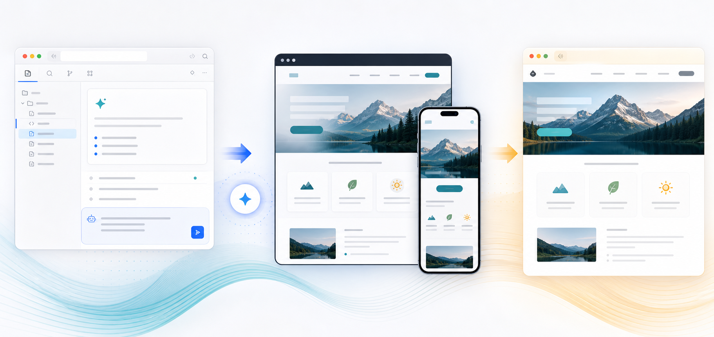
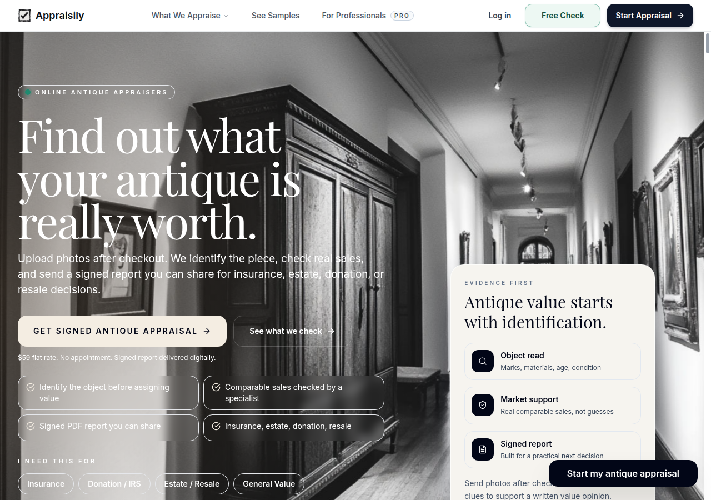
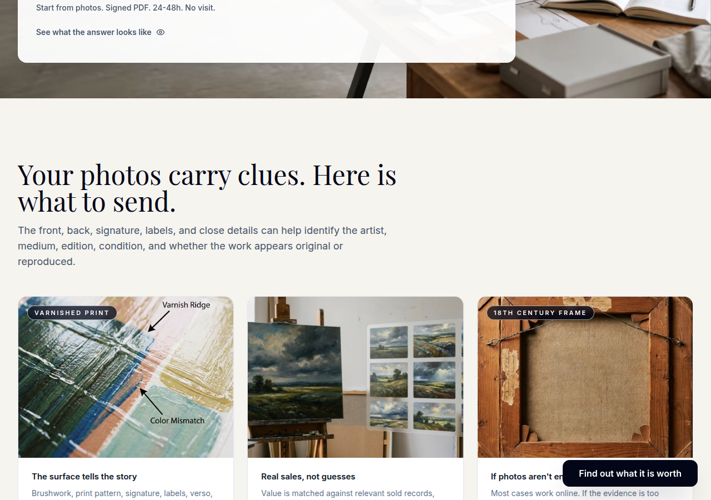
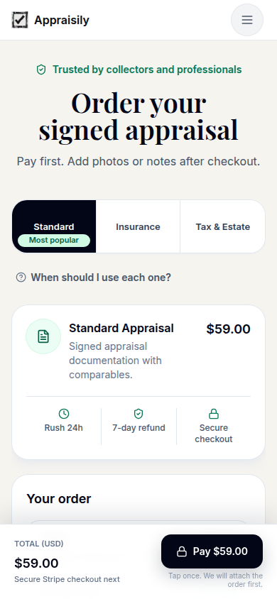
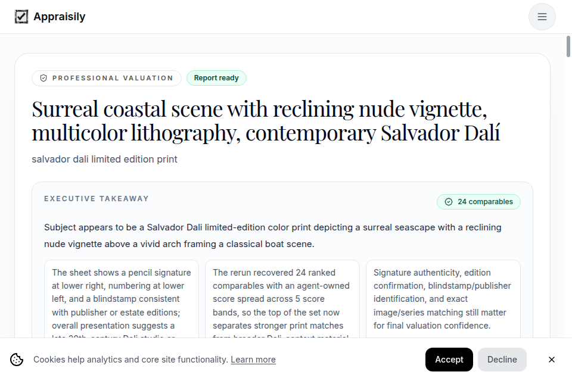
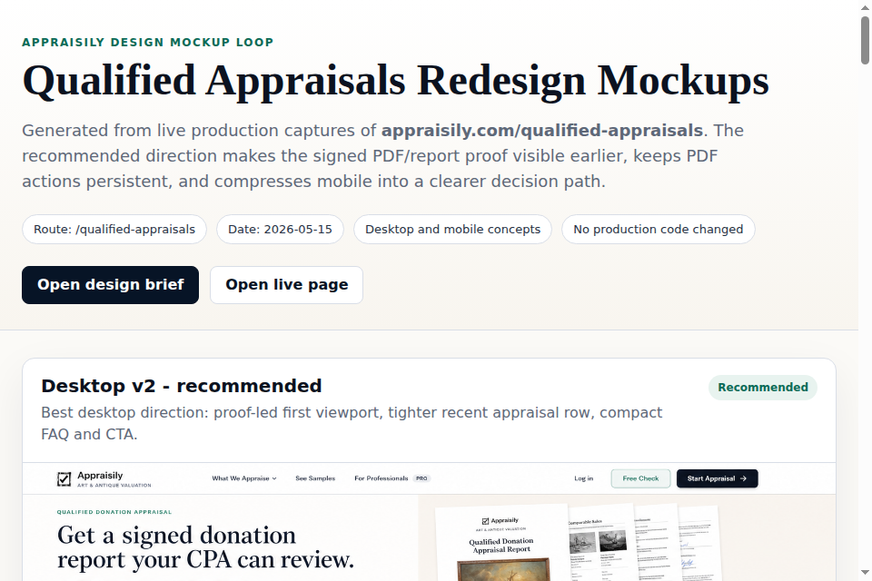
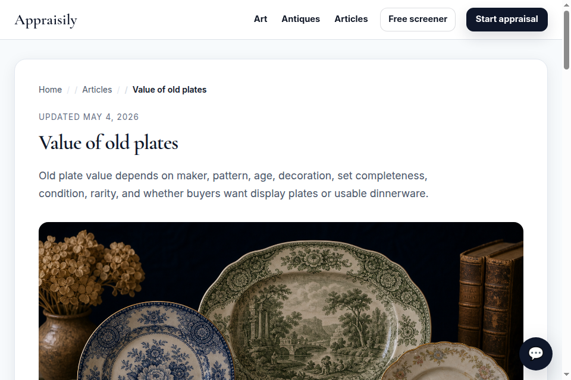

# Design Mockup Loop Skill



Portable Codex skill for turning live page screenshots into AI-generated desktop
and mobile GUI mockups.

The workflow is intentionally simple:

1. Capture clean viewport screenshots of the current page.
2. Analyze hierarchy, spacing, CTA path, trust signals, and visual constraints.
3. Generate two desktop mockup passes and two mobile mockup passes.
4. Choose the strongest direction and write implementation notes.
5. Optionally publish a static HTML review page.

## Example Use Cases

Use it when you want design direction before touching production code.

### Landing Page Redesign

Useful for paid or SEO landing pages where the hero, trust proof, and CTA path
need to feel clearer.



```text
$design-mockup-loop create desktop and mobile mockups for https://appraisily.com/antiques.
Focus on the hero, proof strip, service explanation, and primary start CTA.
Keep the page credible for antique owners who need an online appraisal.
```

### Section-Level Improvement

Useful when one section is weak but the rest of the page is mostly fine, such as
a sample-report block, process section, comparison table, or pricing/order band.



```text
$design-mockup-loop mock up only the sample report showcase section on this page:
https://appraisily.com/art
Capture the current desktop and mobile section, then generate stronger layouts
that make the sample reports feel more inspectable and trustworthy.
```

### Funnel Step / Checkout UX

Useful for improving forms, upload steps, pricing choices, sticky CTAs, and
decision-heavy product flows.



```text
$design-mockup-loop create mockups for https://appraisily.com/start.
Focus on the first upload/selection screen, checkout readiness, mobile sticky
CTA behavior, and reducing visual friction before payment.
```

### Result Page / Upgrade CTA

Useful for free-tool result pages, report previews, dashboards, or any screen
where the next action needs to be more obvious.



```text
$design-mockup-loop create desktop and mobile mockups for this result page URL.
Focus on result clarity, confidence hierarchy, next-step CTA placement, and how
to show evidence without making the page feel dense.
```

### Existing HTML Prototype Review

Useful for old static prototypes, generated proposals, or one-off HTML pages
already hosted on a public asset server.



```text
$design-mockup-loop improve this existing HTML concept:
https://your-assets-domain.com/design-proposals/example-run/index.html
Use the current prototype as the screenshot reference and produce a cleaner,
more implementable desktop and mobile direction.
```

### Article / Content CTA Blocks

Useful for long-form content where readers need a clearer next step without
turning the article into a heavy landing page.



```text
$design-mockup-loop create mockups for the CTA and next-step blocks on this
article page. Preserve the article reading experience, but make the appraisal
path, trust proof, and sample/report links easier to scan.
```

## Install

Clone the repository and link the skill into your Codex skills directory:

```bash
git clone https://github.com/Appraisily/design-mockup-loop-skill.git
mkdir -p ~/.codex/skills
ln -s "$PWD/design-mockup-loop-skill/skills/design-mockup-loop" ~/.codex/skills/design-mockup-loop
```

Then trigger it with:

```text
$design-mockup-loop create desktop and mobile mockups for https://example.com/pricing
```

## Optional Environment

The skill works with local artifacts by default. Set these if you want a stable
output location or public review publishing:

```bash
export DESIGN_MOCKUP_EVIDENCE_ROOT="$PWD/runs"
export DESIGN_MOCKUP_PUBLIC_ROOT="$PWD/public/design-proposals"
export DESIGN_MOCKUP_PUBLIC_BASE_URL="https://example.com/design-proposals"
```

If `DESIGN_MOCKUP_PUBLIC_BASE_URL` is unset, the review page is saved locally and
the final answer should provide local artifact paths.

## Requirements

- A browser automation tool available to Codex, such as `agent-browser`,
  Playwright, or an equivalent browser skill.
- An image-generation capability available to Codex.
- Shell access for creating artifact folders and writing the review page.

No production code is changed by this skill unless a later implementation task
explicitly asks for it.

## Dependency Setup

This repository does not auto-install runtime tools. A Codex skill is an
instruction bundle; it assumes the host already has the browser and image
generation capabilities available.

For screenshots, the recommended browser CLI is Vercel's `agent-browser`:

```bash
npm install -g agent-browser
agent-browser install
```

On Linux, also install browser system dependencies:

```bash
agent-browser install --with-deps
```

Then verify:

```bash
agent-browser doctor --offline --quick
agent-browser --help
```

For image generation, use the image-generation tool exposed by your Codex
environment, such as `$imagegen`. There is no npm package in this repo that can
enable Codex image generation by itself. If your Codex environment does not have
image generation, the skill can still capture screenshots and write the design
brief, but the mockup-generation step needs another image model/tool.
